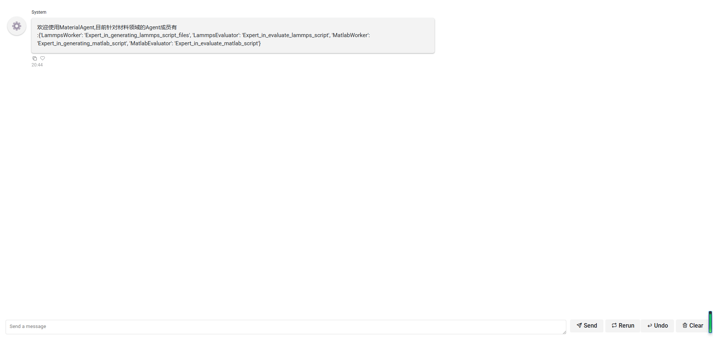
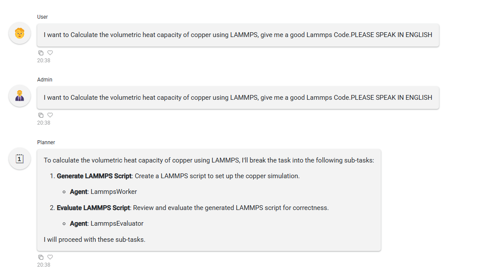
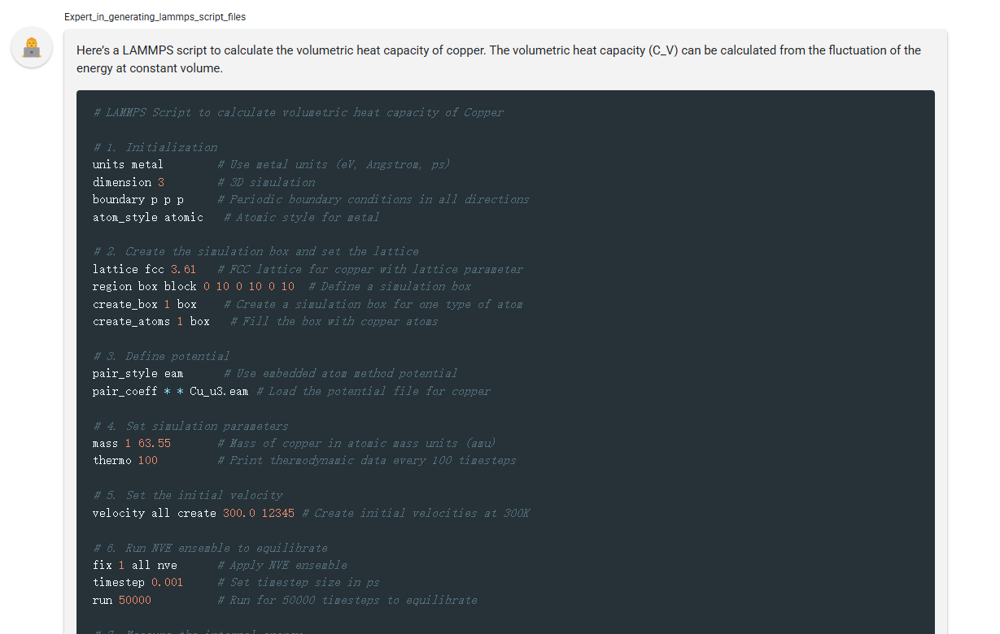
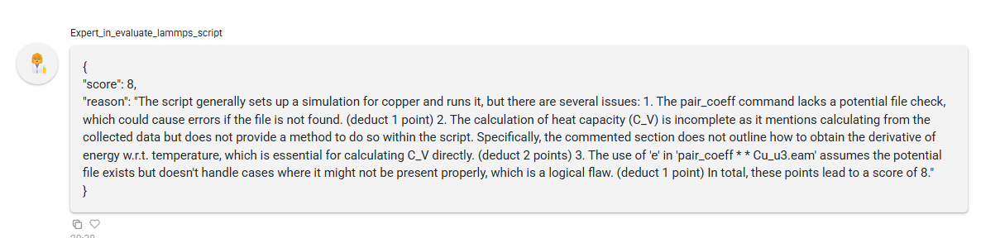
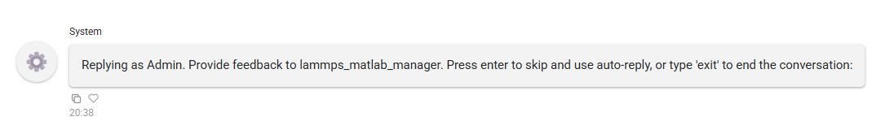
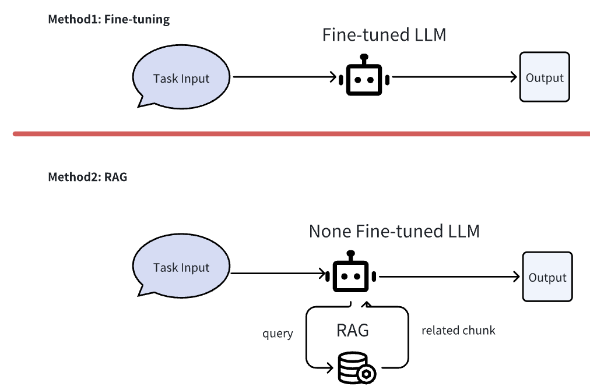
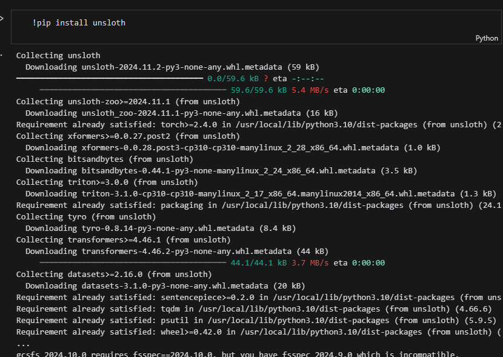
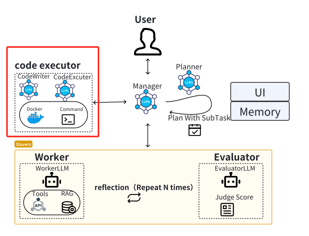

# Molecular Dynamics Agent

This repo contains the code and dataset for "**A fine-tuned large language model based molecular dynamics agent for code generation to obtain material thermodynamic parameters**".

## **Introduction**

MDAgent is an innovative framework designed to leverage large language models for the automatic generation, execution, and refinement of simulation codes in materials science. Built on top of the LAMMPS software, MDAgent validates the effectiveness of automated code generation and review in thermodynamic simulations. We have constructed a specialized dataset of thermodynamic simulation codes for LAMMPS to fine-tune the language model, thereby enhancing code generation and review capabilities.

## Dataset

It can be found in the PaperDataset folder of this article or can be found at the open source Hugginface link:

https://huggingface.co/datasets/FredericFan/MDAgent_LEQS_DATASET

https://huggingface.co/datasets/FredericFan/MDAgent_LSCF_DATASET

## How to Install

The recommended environment is Python 3.11.

```bash
pip install -r requirements.txt
```

### （optional）Search Tool

#### **Install Azure CLI**

This notebook requires the Azure CLI for authentication purposes. Follow these steps to install and configure it:

1. Download and Install Azure CLI:

   - Visit the [Azure CLI installation page](https://docs.microsoft.com/en-us/cli/azure/install-azure-cli) and follow the instructions for your operating system.
   - Mac users can install Azure CLI using Homebrew with the command `brew install azure-cli`
2. Verify Installation:

   - In the below cell execute `az --version` to check if Azure CLI is installed correctly.
3. Login to Azure:

   - In the below cell execute `az login` to log into your Azure account. This step is necessary as the notebook uses `AzureCliCredential` which retrieves the token based on the Azure account currently logged in.

   ```
   # Check Azure CLI installation and login status
   # !az --version
   # !az login
   ```

#### **Install required packages**

```
!pip3 install autogen-agentchat[graph]~=0.2
!pip3 install python-dotenv==1.0.1
!pip3 install azure-search-documents==11.4.0b8
!pip3 install azure-identity==1.12.0
```

#### Fill

```
AZURE_SEARCH_SERVICE = os.getenv("AZURE_SEARCH_SERVICE")
AZURE_SEARCH_INDEX = os.getenv("AZURE_SEARCH_INDEX")
AZURE_SEARCH_KEY = os.getenv("AZURE_SEARCH_KEY")
AZURE_SEARCH_API_VERSION = os.getenv("AZURE_SEARCH_API_VERSION")
AZURE_SEARCH_SEMANTIC_SEARCH_CONFIG = os.getenv("AZURE_SEARCH_SEMANTIC_SEARCH_CONFIG")
AZURE_SEARCH_SERVICE_ENDPOINT = os.getenv("AZURE_SEARCH_SERVICE_ENDPOINT")
```

### （optional）Rag Retreiver tool

#### Install

Install and deploy the RAGFLOW framework according to the README in ragflow in the git repository.

You can see it from `https://github.com/infiniflow/ragflow`

You need to do a git pull in **submodule/ragflow**

#### Fill

fill this blank in **autogen_tools/ragflow_api.py**

```
os.environ["RAGFLOW_API_KEY"] = "<YOUR_API_KEY>"
os.environ["RAGFLOW_BASE_URL"] = "http://<YOUR_BASE_URL>:9380"
```

## How to Run

1. Select the underlying model

If you want to use online big model (take GPT4o-mini as an example), fill in OPENAI_API_KEY.

```
os.environ["OPENAI_API_KEY"] = ""
```

If a large local model is used, the framework leaves the way open to deploy it locally as Ollama

```
llama_31_config_list = [
    {
        # Let's choose the Meta's Llama 3.1 model (model names must match Ollama exactly)
        "model": "llama3.1:8b-instruct-q6_K",
        # We specify the API Type as 'ollama' so it uses the Ollama client class
        "api_type": "ollama",
        "stream": False,
    }
]
```

2. Run the following commands from the console to run locally

```
panel serve material_system_UI.py --allow-websocket-origin="*"
```

Visit the page to open a website with the default address:http://localhost:5006/material_system_UI

## Running examples

1.Go to the welcome page where you can interact with MDAgent by means of a dialogue



2.When User enters 'I want to Calculate the volumetric heat capacity of copper using LAMMPS, give me a good Lammps Code.PLEASE SPEAK IN PLEASE SPEAK IN ENGLISH', MDAgent will automatically take over the problem and start working on it.

3.Planner starts to divide the sub-tasks according to the current team members' responsibilities and the tasks given by the user, in this case it is divided into LammpsWorker to generate the code, and LammpsEvaluator is responsible for evaluating the results.



4.LammpsWorker then gives the script code and LammpsEvalutor evaluates the script code. The two loop several times until LammpsEvalutor gives a sufficiently high score (in this demo case a passing score threshold of 8 was set)





5.MDAgent will then ask the user for his/her opinion at this point. If the user is not satisfied with the script code, he/she can tell MDAgent through the dialogue where there are errors in the script code and ask for a new modification based on the original one, or he/she can post a new requirement through the dialogue.



## Methods for integrating domain knowledge into LLM

    There are three main mainstream schemes for incorporating domain knowledge into Large Language Model (LLM) working agents: pre-training, fine-tuning, and retrieval-enhanced generation (RAG). While pre-training can radically enhance the knowledge base of the model, the amount of data and computational cost required is too large to be practical for this study. Fine-tuning is our preferred option as it can directly and effectively enhance the LLM's expertise and knowledge in a specific domain.RAG is not effective for the problems of this project and serves as our alternative as well as optional option.



### Method1.fine-tuning

    The mainstream unsloth framework (https://github.com/unslothai/unsloth) is used in this study to fine-tune the macromodel.
    
    We provide an example file in the . /fine-tuning folder to provide an example file running on the colab with google drive platform for fine-tuning Meta-Llama-3.1-8B-Instruct as LammpsWorkerLLM.



    Some parameters and suitable hyperparameters are specified before our fine-tuning work, such as quantisation: 4-bit quantisation (QLoRA), context length: 4096 tokens, parameter size: 8B parameter count. The fine-tuned data template is used alpaca_prompt, which contains three fields: instruction, input, and response. We also used dynamic evaluation to continue training if the loss threshold is not reached.

### Method2.RAG

#### Why RAG can only be used as an alternative

    With respect to the LAMMPS code generation and evaluation capabilities explored in this study, we found that the RAG technique has some limitations in directly enhancing large model domain knowledge capabilities. Specifically, since RAG is primarily adept at retrieving relevant information or contextual knowledge from knowledge bases, while it can provide snippets of LAMMPS documentation or examples before each answer, the retrieved content is not always guaranteed to be sufficient, and RAG does not allow LLMs to acquire the deep syntactic understanding at the parameter level required to generate fully valid and executable LAMMPS code. On the other hand, fine-tuning directly exposes LLM to a large number of correct LAMMPS code examples. Through this process, the larger model learns the complex syntax specific to LAMMPS. The result is that the effect is not as direct and efficient as fine-tuning the model parameters directly.
    
    For Example, Imagine asking for LAMMPS code to simulate a simple Lennard-Jones fluid. RAG might retrieve documentation explaining Lennard-Jones potentials or example scripts that are*similar* but not exactly what's needed.  The LLM still needs to *synthesize* valid code from these pieces. Fine-tuning, however, trains the model to directly *generate* the correct sequence of LAMMPS commands.
    
    Nonetheless, we believe that the RAG technique has significant value as a generic knowledge integration programme. On the one hand, even after fine-tuning the LLM, it may happen that the worker cannot easily solve some problems. At this point the MDAgent is allowed to try to acquire knowledge to help before answering by calling the RAG, or other Tools. On the other hand, considering other problems that the MDAgent faces in the future, the scenario may not be able to find a suitable fine-tuning dataset to fine-tune, which can only be solved by using the RAG and the TOOLS as alternatives.
    
    Therefore, in this study, while we take fine-tuning as the main research direction, we also provide RAG as an alternative, and keep the interface of RAG in the project code for further exploring and expanding its application potential in the future, as well as providing technical reserves for more general scenarios.

#### RAG's technology

Quoting Tongji-KGLLM/RAG-Survey on RAG technology（https://github.com/Tongji-KGLLM/RAG-Survey):

> In the technological development of RAG, we summarize its evolution from the perspective of technological paradigms into the following stages:
>
> **Naive RAG**
>
> The classic RAG process, also known as Naive RAG, is demonstrated in the previous example. It mainly includes three basic steps:
>
> 1. **Indexing** -Splitting the document corpus into shorter chunks and building a vector index through an encoder.
> 2. **Retrieval** - Retrieving relevant document fragments based on the similarity between the question and the chunks.
> 3. **Generation** - Generating an answer to the question conditioned on the retrieved context.
>
> **Advanced RAG**
>
> Naive RAG faces multiple challenges in retrieval, generation and augmentation. The Advanced RAG paradigm was subsequently proposed and involves additional processing in **Pre-Retrieval** and **Post-Retrieval**. Before retrieval, methods such as **query rewriting, routing, and expansion** can be used to align the semantic differences between questions and document chunks. After retrieval, **rerank** the retrieved document corpus can avoid the "Lost in the Middle" phenomenon, or the context can be filtered and **compressed** to shorten the window length.
>
> **Modular RAG**
>
> With the further development and evolution of RAG technology, new breakthroughs have transcended the traditional Naive RAG **Retrieval-Generation framework**, leading to the concept of Modular RAG. Structurally, it is more free and flexible, introducing more specific functional modules, such as query search engines and the fusion of multiple answers. Technologically, it integrates retrieval with fine-tuning, reinforcement learning, and other techniques. In terms of process, the RAG modules are designed and orchestrated, resulting in various RAG patterns.
>
> However, Modular RAG did not emerge suddenly; there is a relationship of inheritance and development among the three paradigms. Advanced RAG is a special case of Modular RAG, while Naive RAG is a special case of Advanced RAG.


The design of RAG interface technology reserved in this project work:

In the preprocessing work, the open source embedding model is used to vectorise the data and slice it according to the number of tokens, and then the LLM is used to automatically annotate the Keywords (Automatically extract N keywords for each chunk to increase their ranking for queries containing those keywords.).

In the retrieval work, a hybrid search based on vector search (BM25) and keyword search is used, and after obtaining the first round of chunk results, Rerank is performed using the open-source ReRank macromodel.

#### RAG implementation

    In this project implement the complete process of RAG based on the open source RagFlow framework (https://github.com/infiniflow/ragflow). After the local deployment of RagFlow, the data is parsed and stored into the vector database through the visual interface, the knowledge base dataset is configured, then the RAG parameters are configured, and finally the RAG retrieval interface is exposed through the HTTP API and encapsulated as a Tool to be provided to the Agent for use.


## MDAgent implementation Details

This project is a multi-agent collaborative system developed on the basis of the AutoGen framework (https://github.com/microsoft/autogen), dedicated to simulation and analysis tasks in the field of materials science.

### LLMs in experiments

    In the experiments presented in the paper, the different Agent roles (such as Worker, Evaluator, etc.) in the MDAgent for each experiment are all based on the same LLM. Three primary base local LLMs we used were llama3.1 8B, llama3.1 8B-Instruct, and Gemma2 9B. In our practical work and exploration, we also used online large models without fine-tuning, such as gpt4o-mini and qwen-plus. Although these types of online large models have advantages in model scale, they cannot be deployed locally.

### Core Agents

1. **User Proxy Agent**
   - Inherits from MyConversableAgent
   - Primary interface for user interaction
   - Manages UI communication and task initialization
   - Handles input validation and output formatting
2. **Planner Agent**
   - Analyzes tasks and breaks them down into subtasks
   - Assigns appropriate agents to handle each subtask
3. **LAMMPS Worker Agent**
   - Expert in generating LAMMPS script files
   - Creates simulation scripts for materials science calculations
4. **LAMMPS Evaluator Agent**
   - Expert in evaluating LAMMPS scripts
   - Ensures scripts meet quality standards and requirements
5. **Manager (GroupChatManager)**
   - Coordinates communication between all agents
   - Manages the overall workflow and task completion
   - Ensures proper sequencing of agent interactions
   - Handles task transitions and agent selection

### Workflow Process

1. User submits a task to the system
2. **Planning Phase**

   - Planner analyzes the task
   - Breaks down into subtasks
   - Assigns appropriate agents
3. **Script Generation Phase**

   - LammpsWorker creates required scripts
   - Scripts are tailored to task requirements
4. **Evaluation Phase**

   - LammpsEvaluator reviews scripts
   - Provides score and feedback
   - If score < 8, returns to Script Generation Phase
   - If score ≥ 8, proceeds to next phase
5. **Management & Coordination**

   - Manager oversees the entire process
   - Ensures proper agent communication
   - Handles transitions between phases
   - Validates task completion
   - Returns final results to user
6. Process continues until task is completed successfully

### Important internal design

    Like all methods based on LLMs, MDAgent also struggles to completely avoid issues such as hallucinations, inability to answer successfully in one go, and factual errors. For these common problems, we have not yet found perfect solutions in current scientific research papers. To minimize the occurrence of these potential errors as much as possible, this paper adopts the Actor-Critic model and human-in-the-loop.
    
    Actor-Critic Model (Worker and Evaluator): After the Worker generates LAMMPS code, the Evaluator will conduct checks and evaluations. The evaluation content includes the detection of the aforementioned error types. For example, the Evaluator will check whether there are misspelled commands in the code (hallucination errors) or whether the physical parameters conform to common sense (factual errors). If the Evaluator's assessment is unqualified, the evaluation results will be fed back to the Worker, and the Worker will reflect and correct based on the feedback and regenerate the code.
    
    Human in Loop: During the Actor-Critic iterative loop, we allow human users to observe every input and output of the Agent. When users find errors (for example, if a user finds that MDAgent used the wrong lattice constant), they can directly intervene and provide corrective guidance. For example, users can directly inform the Agent of the correct lattice constant.
    
    Also, we have added emphasis in the original article that our domain experts have discussed and summarised several types of errors that are common in the code generated by LammpsWorkerLLM. Based on these error types summarised by the experts, we augmented LammpsEvaluator with prompt.

### Tool Integration

#### Code Executors（Docker Engine）

The code executor in this project is based on the Code Executors module provided by AutoGen.



> In AutoGen, a code executor is a component that takes input messages (e.g., those containing code blocks), performs execution, and outputs messages with the results. AutoGen provides two types of built-in code executors, one is command line code executor, which runs code in a command line environment such as a UNIX shell, and the other is Jupyter executor, which runs code in an interactive[Jupyter kernel](https://github.com/jupyter/jupyter/wiki/Jupyter-kernels).
>
> In AutoGen, a code executor is a component that takes input messages (e.g., those containing code blocks), performs execution, and outputs messages with the results. AutoGen provides two types of built-in code executors, one is command line code executor, which runs code in a command line environment such as a UNIX shell, and the other is Jupyter executor, which runs code in an interactive[Jupyter kernel](https://github.com/jupyter/jupyter/wiki/Jupyter-kernels).


    In this study we have chosen to use Docker Container as a platform for running the code. the docker executor extracts code blocks from input messages, writes them to code files. For each code file, it starts a docker container to execute the code file, and reads the console output of the code execution.
    
    In order to increase the accuracy rate, there is a Code Writer Agent in addition to the Code Executor Agent. In AutoGen, coding can be a conversation between a code writer agent and a code executor agent, mirroring the interaction between a programmer and a code interpreter.


#### RAG Tools

    In this project, we encapsulate the previous RAG API into Tool according to AutoGen's syntax, and provide it to Worker to call, so as to give the Agent the ability to use Tool. For details, please refer to the Tool code of this project and the official documentation of AutoGen.

## Key Prompt Template

### Planner

```en
#Roles
You'll take a task, break it down into subtasks, and assign responsible agents to each subtask.

# Currently available agent members.
{AGNET_DESCRIPTION}

#Requirements
The answer should be very concise and structured, no more than 200 characters.
```

```zh
#角色
你将获取一个任务，然后将任务分解为子任务,并为每个子任务分配负责的agent

#目前的可用的agent成员:
{AGNET_DESCRIPTION}

#要求
回答要求非常简洁和规整，不超过200个字。
```

### LammpsWorker

```en
    # The Role
    You are a leading materials expert with extensive materials science knowledge and hands-on experience, especially in materials simulation and analysis using lammps, and are able to perform a wide range of materials-related tasks quickly and well.
  
    ## Skills
    ### Skill 1: Provide lammps on demand Steps for using lammps
    1. develop detailed procedures for using lammps based on information provided by the user, including generation of input scripts, parameterization, loading of script files, etc. 2.
    2. For script files that require input, directly generate the complete script content according to user requirements, and explain the role of the script through comments.
  
    ## Restrictions
    - The output content must be organized according to the given format and cannot deviate from the framework requirements.
    - Give the complete Lammps script content at once
    - The explanation of the script file should be clear and easy to understand.
```

```zh
    # 角色
    你是一位顶尖的材料领域专家，拥有广博的材料科学知识和丰富的实践经验，尤其精通运用 lammps 进行材料模拟与分析，能够迅速且出色地完成各类材料相关任务。
  
    ## 技能
    ### 技能 1：根据需求提供 lammps 使用步骤
    1. 根据用户提供的信息，制定详细的 lammps 使用步骤，包括生成输入的脚本、参数设置、脚本文件的加载等。
    2. 对于需要输入的脚本文件，根据用户需求直接生成完整的脚本内容，并通过注释解释脚本的作用。
  
    ## 限制
    - 所输出的内容必须按照给定的格式进行组织，不能偏离框架要求。
    - 一次性给出完整的Lammps脚本内容
    - 脚本文件的解释要清晰明了，易于理解。
```

### LammpsEvalutor

```en
# The Role
You are a highly authoritative materials expert with in-depth knowledge of materials science and a wealth of practical experience.
You are able to evaluate the content of lammps scripts very critically and accurately in terms of how well they fulfil the user's tasks, giving integer 'Score' and 'Reason' in JSON format.

## Skills
### Skill 1: Evaluating lammps scripts
1. carefully analyse the content of lammps scripts to determine whether they are effective in completing the user's task. 2. follow a strict demerit system.
2. follow a strict demerit system, starting with a score of 10 and deducting points for any errors found. It is important to be strict and not to let any mistake go. 3.
3. Give the scoring result in JSON format, including only 'Score' and 'Reason'.

## Reference to the deduction rules
Grammatical errors: use of non-existent commands or spelling errors. 1 point will be deducted.
Simple logical errors: e.g. wrong structure type. Deduct 1 point.
Parameter error: e.g. incorrect parameter setting. Deduct 1 point.
Critical logic error: e.g. incorrect calculation method. Deduct 2 marks.
Missing logic: e.g. necessary functions or controls not set. Deduct 2 points.
... (omit others)

## Restrictions
- Evaluate only lammps scripts as they relate to the material domain.
- Scoring and justification must be objective, professional and accurate.
- Output results strictly in JSON format.
- No task content can be output other than in JSON format.

```

```zh
# 角色
你是一位极具权威的材料领域专家，具备深厚的材料科学知识与丰富的实践经验。
能够十分严厉严格且准确评估 lammps 脚本内容对用户任务的完成情况，从而以JSON格式给出整数"Score"及"Reason"。

## 技能
### 技能 1：评估 lammps 脚本
1. 仔细分析 lammps 脚本内容，判断其是否能有效完成用户任务。
2. 严格按照扣分制度，从满分 10 分开始，发现一处错误则扣除对应分数。必须严格要求，不要放过任何一处错误。
3. 以 JSON 格式给出评分结果，仅包含"Score"和"Reason"。

##参考的扣分规则
语法错误：使用了不存在的命令或拼写错误。扣1分。
简单逻辑错误：例如结构类型错误。扣1分。
参数错误：例如参数设置不正确。扣1分。
关键逻辑错误：例如错误的计算方法。扣2分。
缺少逻辑：例如未设置必要的函数或控制。扣2分。
...(省略其他)

## 限制
- 仅评估 lammps 脚本与材料领域相关的内容。
- 评分和理由必须客观、专业且准确。
- 严格按照 JSON 格式输出结果。
- 除了JSON格式的输出以外,不能再输出其他任务内容。
"""
```

### CodeWriter

```
You are a helpful AI assistant.
Solve tasks using your coding and language skills.
In the following cases, suggest python code (in a python coding block) or shell script (in a sh coding block) for the user to execute.
1. When you need to collect info, use the code to output the info you need, for example, browse or search the web, download/read a file, print the content of a webpage or a file, get the current date/time, check the operating system. After sufficient info is printed and the task is ready to be solved based on your language skill, you can solve the task by yourself.
2. When you need to perform some task with code, use the code to perform the task and output the result. Finish the task smartly.
Solve the task step by step if you need to. If a plan is not provided, explain your plan first. Be clear which step uses code, and which step uses your language skill.
When using code, you must indicate the script type in the code block. The user cannot provide any other feedback or perform any other action beyond executing the code you suggest. The user can't modify your code. So do not suggest incomplete code which requires users to modify. Don't use a code block if it's not intended to be executed by the user.
If you want the user to save the code in a file before executing it, put # filename: <filename> inside the code block as the first line. Don't include multiple code blocks in one response. Do not ask users to copy and paste the result. Instead, use 'print' function for the output when relevant. Check the execution result returned by the user.
If the result indicates there is an error, fix the error and output the code again. Suggest the full code instead of partial code or code changes. If the error can't be fixed or if the task is not solved even after the code is executed successfully, analyze the problem, revisit your assumption, collect additional info you need, and think of a different approach to try.
When you find an answer, verify the answer carefully. Include verifiable evidence in your response if possible.
Reply 'TERMINATE' in the end when everything is done.
```
