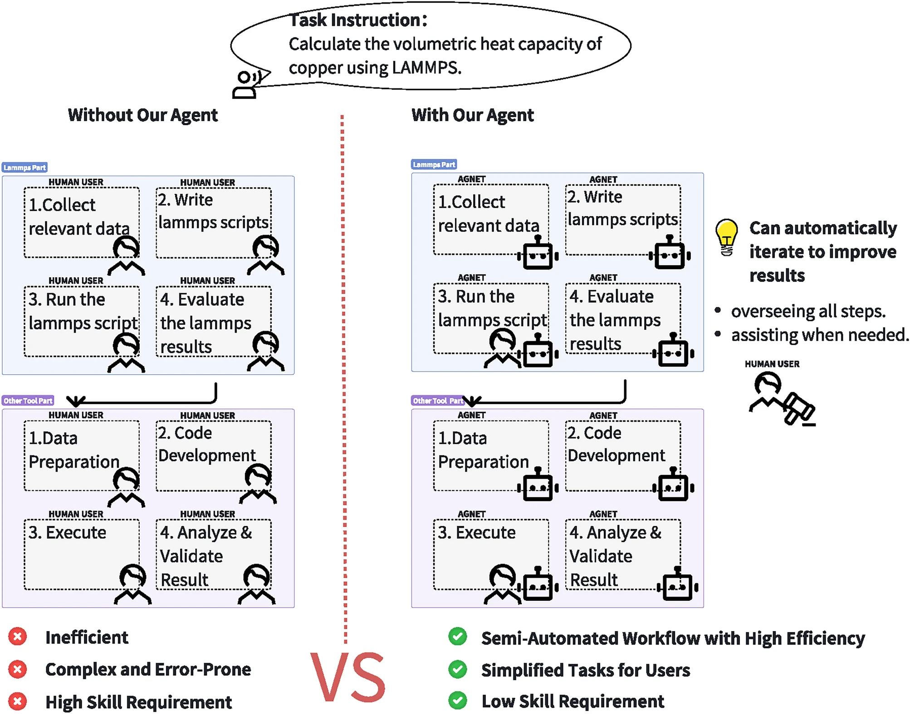
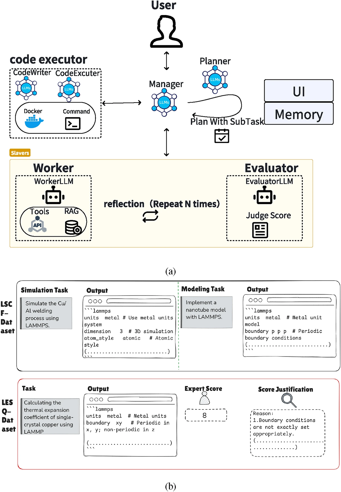
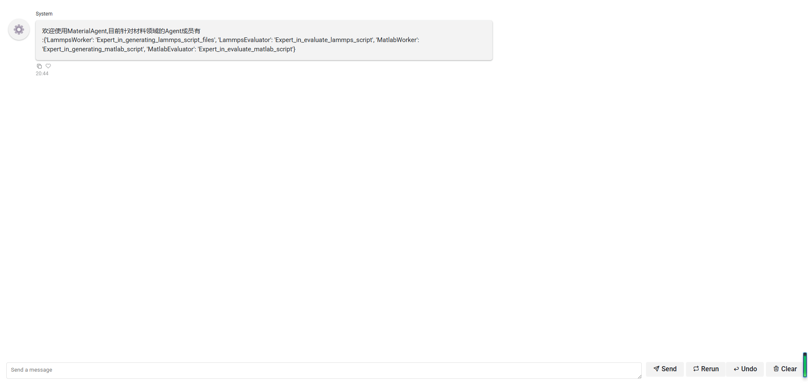
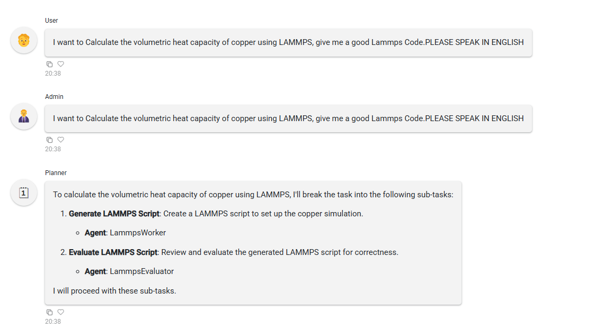
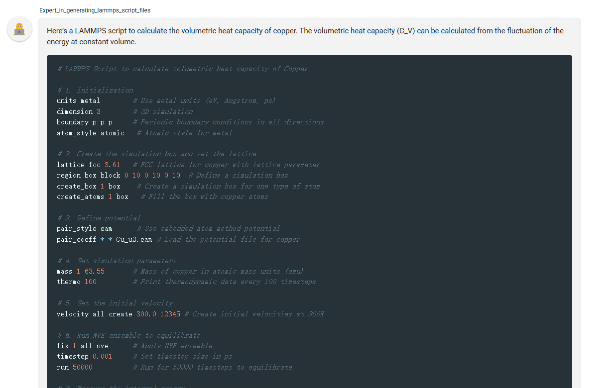
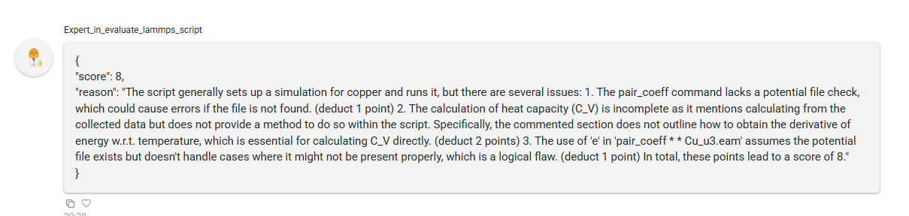
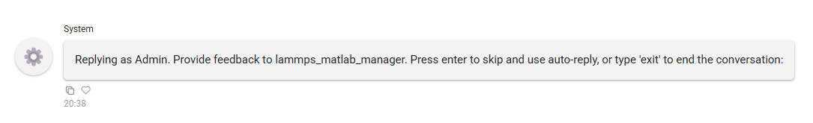
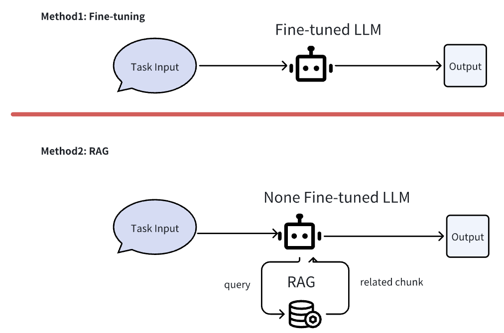
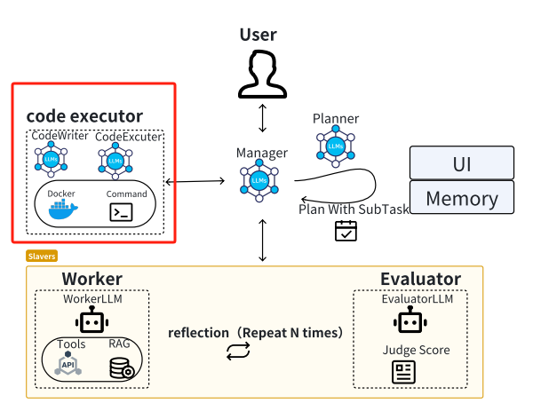

# 📚Molecular Dynamics Agent（MDAgent）

> **[NEWS] 2026:** We redesigned the user interface and refactored the repository to improve usability and maintainability.

**《A fine-tuned large language model based molecular dynamics agent for code generation to obtain material thermodynamic parameters》**

📄 *Published in* **Scientific Reports**

<a href="https://www.nature.com/articles/s41598-025-92337-6"></a>

<a href="https://fredericvan.github.io/PKU_MDAgent/"></a>

🏛️ *By* **Peking University**

The **datasets** are available in the **`PaperDataset`** folder of the article or can be accessed via 🤗 **Hugging Face**:<a href="https://huggingface.co/datasets/FredericFan/MDAgent_LEQS_DATASET"></a>

- 🔗 [MDAgent_LEQS_DATASET](https://huggingface.co/datasets/FredericFan/MDAgent_LEQS_DATASET)
- 🔗 [MDAgent_LSCF_DATASET](https://huggingface.co/datasets/FredericFan/MDAgent_LSCF_DATASET)

## 🔍 **Introduction**

In the field of **materials science** 🧬, uncovering the intricate structure–property relationships increasingly relies on **AI-generated content (AIGC)** 🧠 for tasks like **literature mining** and  **data analysis** . Yet, **theoretical computation** and **simulation code writing** remain labor-intensive 🧑‍💻.

This study presents a  **novel framework** :

🚀 **Molecular Dynamics Agent (MDAgent)** — a fine-tuned **text-to-code generation agent** empowered by  **large language models (LLMs)** .

### 🧰 Key Features:

* 📦  **Automatic generation** ,  **execution** , and **refinement** of **thermodynamic simulation code**
* 🔧 Based on **LAMMPS** (Large-scale Atomic/Molecular Massively Parallel Simulator)
* 📚 A curated **LAMMPS thermodynamic simulation dataset** was constructed for fine-tuning
* 🧑‍🔬 **Expert evaluations** show **significant improvement** in code quality and relevance
* ⏱️ Achieves **42.22% reduction** in task time compared to traditional approaches

## Methods



Comparison of thermodynamic analysis workflow with and without the use of Molecular Dynamics Agent (MDAgent). In the process on the left, the manual workflow requires human users to perform every step, resulting in inefficiency, complexity, and high skill requirements. In contrast, in the MDAgent-assisted workflow on the right, the agent automates key tasks in LAMMPS and other software, enabling a semi-automated, efficient process. The agent simplifies user tasks, reduces the skill requirement, and minimizes errors by overseeing each step and assisting the user as needed.



(**a**) Architecture diagram: MDAgent with Manager, Worker, and evaluator powered by large language models (LLMs), interacting through a user interface. (**b**) Example of the dataset used.

## 📂 **Dataset Overview**

The datasets are available in the **`PaperDataset`** folder of the article or can be accessed via 🤗 **Hugging Face**:

- 🔗 [MDAgent_LEQS_DATASET](https://huggingface.co/datasets/FredericFan/MDAgent_LEQS_DATASET)
- 🔗 [MDAgent_LSCF_DATASET](https://huggingface.co/datasets/FredericFan/MDAgent_LSCF_DATASET)

### 🧪 **LSCF-Dataset**

**(LAMMPS Script Construction for Fine-tuning)**

A dataset designed to fine-tune large language models for handling LAMMPS-based **material simulations**. It improves model capabilities for generating accurate and structured LAMMPS input scripts.

#### 🧷 Structure:

- 📌 `instruction`: Code generation task description
- 📌 `input`: Task-specific supplements
- 📌 `output`: Standardized LAMMPS script

**Script Details:**

- 💡 167 scripts total
- 🔧 Sections: **Initialization**, **Modeling**, **Computation**
- 🧾 Source ratio:
  - Manual production: 1️⃣
  - LAMMPS official docs: 2️⃣
  - Online repositories: 2️⃣

#### 📈 Application Scenarios:

- 🏗️ Material mechanical property simulation
- 🔬 Synthesis & processing simulation
- 🧩 Interface simulation
- 💧 Fluid dynamics simulation
- 🌡️ Heat transfer simulation

### 📊 **LEQS-Dataset**

**(LAMMPS Expert Quality Scoring)**

A **benchmark dataset** crafted by materials science experts to **evaluate and improve** LLM-generated LAMMPS scripts. Includes expert-assigned scores and rationale for each generated script.

#### 🧷 Structure:

Each data point includes:

- 📌 `instruction`: System prompt for the model (act as an expert reviewer)
- 📌 `input`:
  - User Task Description
  - Generated LAMMPS Script
- 📌 `output`:
  - 🧠 Expert Score (0–10)
  - ❌ Deducted Score
  - 🧾 Scoring Basis (explains the evaluation)

**Format:** Structured for **Supervised Fine-Tuning (SFT)**.

#### 📈 Application Scenarios:

- 📐 Thermal Expansion Coefficient Calculation
- 🔥 Thermal Conductivity Simulation
- ⚖️ Density Calculation
- 🔁 Phase Change Behavior Analysis

## How to Install

Python 3.11 is recommended.

### Windows (PowerShell)

```powershell
py -3.11 -m venv .venv
.\.venv\Scripts\python.exe -m pip install -r requirements.txt
Copy-Item .env.example .env
```

### macOS / Linux

```bash
python3.11 -m venv .venv
./.venv/bin/python -m pip install -r requirements.txt
cp .env.example .env
```

Then edit `.env` and fill in the model provider, model name, and the API key
required by that provider. Do not commit `.env`; it is ignored by Git.

### （optional）Search Tool

#### **Install Azure CLI**

This notebook requires the Azure CLI for authentication purposes. Follow these steps to install and configure it:

1. Download and Install Azure CLI:

   - Visit the [Azure CLI installation page](https://docs.microsoft.com/en-us/cli/azure/install-azure-cli) and follow the instructions for your operating system.
   - Mac users can install Azure CLI using Homebrew with the command `brew install azure-cli`
2. Verify Installation:

   - In the below cell execute `az --version` to check if Azure CLI is installed correctly.
3. Login to Azure:

   - In the below cell execute `az login` to log into your Azure account. This step is necessary as the notebook uses `AzureCliCredential` which retrieves the token based on the Azure account currently logged in.

   ```
   # Check Azure CLI installation and login status
   # !az --version
   # !az login
   ```

#### **Install required packages**

```
!pip3 install autogen-agentchat[graph]~=0.2
!pip3 install python-dotenv==1.0.1
!pip3 install azure-search-documents==11.4.0b8
!pip3 install azure-identity==1.12.0
```

#### Fill

```
AZURE_SEARCH_SERVICE = os.getenv("AZURE_SEARCH_SERVICE")
AZURE_SEARCH_INDEX = os.getenv("AZURE_SEARCH_INDEX")
AZURE_SEARCH_KEY = os.getenv("AZURE_SEARCH_KEY")
AZURE_SEARCH_API_VERSION = os.getenv("AZURE_SEARCH_API_VERSION")
AZURE_SEARCH_SEMANTIC_SEARCH_CONFIG = os.getenv("AZURE_SEARCH_SEMANTIC_SEARCH_CONFIG")
AZURE_SEARCH_SERVICE_ENDPOINT = os.getenv("AZURE_SEARCH_SERVICE_ENDPOINT")
```

### （optional）Rag Retreiver tool

#### Install

Install and deploy the RAGFLOW framework according to the README in ragflow in the git repository.

You can see it from `https://github.com/infiniflow/ragflow`

You need to do a git pull in **submodule/ragflow**

#### Fill

fill this blank in **autogen_tools/ragflow_api.py**

```
os.environ["RAGFLOW_API_KEY"] = "<YOUR_API_KEY>"
os.environ["RAGFLOW_BASE_URL"] = "http://<YOUR_BASE_URL>:9380"
```

## How to Run

All runtime configuration is read from `.env`. Start by choosing a model
provider.

### OpenAI or an OpenAI-compatible service

```dotenv
AUTOGEN_PROVIDER=openai
AUTOGEN_MODEL=gpt-4o-mini
AUTOGEN_WORKER_MODEL=gpt-4o
AUTOGEN_EVALUATOR_MODEL=gpt-4o-mini
AUTOGEN_REQUEST_TIMEOUT=120
AUTOGEN_STREAM=true
AUTOGEN_STREAM_RETRIES=1
AUTOGEN_STREAM_FALLBACK=true
OPENAI_API_KEY=your-api-key
OPENAI_BASE_URL=https://api.openai.com/v1
```

For an OpenAI-compatible service, replace `OPENAI_BASE_URL` and
`AUTOGEN_MODEL` with the endpoint and model name supplied by that service.
`AUTOGEN_WORKER_MODEL` controls both LAMMPS/MATLAB workers, while
`AUTOGEN_EVALUATOR_MODEL` controls both evaluators. Either variable may be
left blank or omitted to reuse `AUTOGEN_MODEL`; Planner, manager, and the code
writer continue to use `AUTOGEN_MODEL`.

### Ollama

Start Ollama and make sure the configured model has been downloaded, then use:

```dotenv
AUTOGEN_PROVIDER=ollama
AUTOGEN_MODEL=qwen3.5:9b
AUTOGEN_WORKER_MODEL=qwen3.5:9b
AUTOGEN_EVALUATOR_MODEL=qwen3.5:9b
AUTOGEN_STREAM=true
OLLAMA_HOST=http://localhost:11434
OLLAMA_THINK=false
OLLAMA_NUM_PREDICT=2048
```

With AutoGen 0.3, MaterialAgent installs a small compatibility bridge that
forwards Ollama response chunks to Chainlit instead of waiting for the adapter
to concatenate the complete response. `OLLAMA_THINK=false` is recommended for
the structured Worker/Evaluator workflow: it streams the final answer directly
and avoids consuming the output budget on hidden reasoning. Supported values
are `false`, `true`, `auto`, `low`, `medium`, and `high`.
`OLLAMA_NUM_PREDICT` prevents a local model from producing an unbounded draft;
2048 is normally enough for a complete LAMMPS script and its review.

### Other runtime options

```dotenv
# disabled or docker; docker requires a running Docker installation
AUTOGEN_CODE_EXECUTOR=disabled

# Stream real model chunks to the terminal or Chainlit UI
AUTOGEN_STREAM=true

# Retry an interrupted provider stream, then use one non-streaming recovery call
AUTOGEN_STREAM_RETRIES=1
AUTOGEN_STREAM_FALLBACK=true

# Enable the optional MATLAB worker/evaluator pair
AUTOGEN_ENABLE_MATLAB=false

# Minimum evaluator score accepted by the workflow
PASS_SCORE=8

# Maximum seconds the Chainlit UI waits for human approval or clarification
CHAINLIT_ASK_TIMEOUT=600
```

### Chainlit UI

Windows PowerShell:

```powershell
$env:DEBUG = "false"
.\.venv\Scripts\chainlit.exe run mdagent_chainlit.py --host 127.0.0.1 --port 8000
```

macOS / Linux:

```bash
DEBUG=false ./.venv/bin/chainlit run mdagent_chainlit.py --host 127.0.0.1 --port 8000
```

Open `http://127.0.0.1:8000/`. Chainlit displays every agent message and uses
an in-chat prompt whenever AutoGen requests approval or essential missing
information. The AutoGen workflow currently owns global agent state, so the UI
runs one workflow at a time.

The explicit `DEBUG=false` avoids a collision with environments that define a
non-boolean global `DEBUG` value (for example `DEBUG=release`), which Chainlit
otherwise interprets as its `--debug` option.

### CLI mode

Start an interactive terminal session:

```powershell
.\.venv\Scripts\python.exe mdagent_autogen.py
```

Or provide the initial task directly:

```powershell
.\.venv\Scripts\python.exe mdagent_autogen.py --mode cli --task "Calculate the volumetric heat capacity of copper using LAMMPS."
```

CLI mode continues to request human approval or feedback in the terminal when
the agent workflow requires it.

### Command-line options

```text
--mode cli    Backward-compatible CLI selector.
--task TEXT   Initial task for CLI mode.
```

Run `python mdagent_autogen.py --help` or `chainlit run --help` to view the
current CLI and web-server options.

## Running examples

1.Go to the welcome page where you can interact with MDAgent by means of a dialogue



2.When User enters 'I want to Calculate the volumetric heat capacity of copper using LAMMPS, give me a good Lammps Code.PLEASE SPEAK IN PLEASE SPEAK IN ENGLISH', MDAgent will automatically take over the problem and start working on it.

3.Planner starts to divide the sub-tasks according to the current team members' responsibilities and the tasks given by the user, in this case it is divided into LammpsWorker to generate the code, and LammpsEvaluator is responsible for evaluating the results.



4.LammpsWorker then gives the script code and LammpsEvalutor evaluates the script code. The two loop several times until LammpsEvalutor gives a sufficiently high score (in this demo case a passing score threshold of 8 was set)





5.MDAgent will then ask the user for his/her opinion at this point. If the user is not satisfied with the script code, he/she can tell MDAgent through the dialogue where there are errors in the script code and ask for a new modification based on the original one, or he/she can post a new requirement through the dialogue.



## Methods for integrating domain knowledge into LLM

    There are three main mainstream schemes for incorporating domain knowledge into Large Language Model (LLM) working agents: pre-training, fine-tuning, and retrieval-enhanced generation (RAG). While pre-training can radically enhance the knowledge base of the model, the amount of data and computational cost required is too large to be practical for this study. Fine-tuning is our preferred option as it can directly and effectively enhance the LLM's expertise and knowledge in a specific domain.RAG is not effective for the problems of this project and serves as our alternative as well as optional option.



### Method1.fine-tuning

    This study uses the Unsloth framework (https://github.com/unslothai/unsloth) for efficient supervised fine-tuning (SFT) of large language models.

    The `fine_tuning/` directory provides example notebooks that demonstrate how to perform SFT with Unsloth in Google Colab using datasets stored in Google Drive. These notebooks are general fine-tuning references and are not tied to a specific MDAgent role.

### Method2.RAG

#### Why RAG can only be used as an alternative

    With respect to the LAMMPS code generation and evaluation capabilities explored in this study, we found that the RAG technique has some limitations in directly enhancing large model domain knowledge capabilities. Specifically, since RAG is primarily adept at retrieving relevant information or contextual knowledge from knowledge bases, while it can provide snippets of LAMMPS documentation or examples before each answer, the retrieved content is not always guaranteed to be sufficient, and RAG does not allow LLMs to acquire the deep syntactic understanding at the parameter level required to generate fully valid and executable LAMMPS code. On the other hand, fine-tuning directly exposes LLM to a large number of correct LAMMPS code examples. Through this process, the larger model learns the complex syntax specific to LAMMPS. The result is that the effect is not as direct and efficient as fine-tuning the model parameters directly.

    For Example, Imagine asking for LAMMPS code to simulate a simple Lennard-Jones fluid. RAG might retrieve documentation explaining Lennard-Jones potentials or example scripts that are*similar* but not exactly what's needed.  The LLM still needs to *synthesize* valid code from these pieces. Fine-tuning, however, trains the model to directly *generate* the correct sequence of LAMMPS commands.

    Nonetheless, we believe that the RAG technique has significant value as a generic knowledge integration programme. On the one hand, even after fine-tuning the LLM, it may happen that the worker cannot easily solve some problems. At this point the MDAgent is allowed to try to acquire knowledge to help before answering by calling the RAG, or other Tools. On the other hand, considering other problems that the MDAgent faces in the future, the scenario may not be able to find a suitable fine-tuning dataset to fine-tune, which can only be solved by using the RAG and the TOOLS as alternatives.

    Therefore, in this study, while we take fine-tuning as the main research direction, we also provide RAG as an alternative, and keep the interface of RAG in the project code for further exploring and expanding its application potential in the future, as well as providing technical reserves for more general scenarios.

## MDAgent implementation Details

This project is a multi-agent collaborative system developed on the basis of the AutoGen framework (https://github.com/microsoft/autogen), dedicated to simulation and analysis tasks in the field of materials science.

### LLMs in experiments

    In the experiments presented in the paper, the different Agent roles (such as Worker, Evaluator, etc.) in the MDAgent for each experiment are all based on the same LLM. Three primary base local LLMs we used were llama3.1 8B, llama3.1 8B-Instruct, and Gemma2 9B. In our practical work and exploration, we also used online large models without fine-tuning, such as gpt4o-mini and qwen-plus. Although these types of online large models have advantages in model scale, they cannot be deployed locally.

### Core Agents

1. **User Proxy Agent**
   - Inherits from MyConversableAgent
   - Primary interface for user interaction
   - Manages UI communication and task initialization
   - Handles input validation and output formatting
2. **Planner Agent**
   - Analyzes tasks and breaks them down into subtasks
   - Assigns appropriate agents to handle each subtask
3. **LAMMPS Worker Agent**
   - Expert in generating LAMMPS script files
   - Creates simulation scripts for materials science calculations
4. **LAMMPS Evaluator Agent**
   - Expert in evaluating LAMMPS scripts
   - Ensures scripts meet quality standards and requirements
5. **Manager (GroupChatManager)**
   - Coordinates communication between all agents
   - Manages the overall workflow and task completion
   - Ensures proper sequencing of agent interactions
   - Handles task transitions and agent selection

### Workflow Process

1. User submits a task to the system
2. **Planning Phase**

   - Planner analyzes the task
   - Breaks down into subtasks
   - Assigns appropriate agents
3. **Script Generation Phase**

   - LammpsWorker creates required scripts
   - Scripts are tailored to task requirements
4. **Evaluation Phase**

   - LammpsEvaluator reviews scripts
   - Provides score and feedback
   - If score < 8, returns to Script Generation Phase
   - If score ≥ 8, proceeds to next phase
5. **Management & Coordination**

   - Manager oversees the entire process
   - Ensures proper agent communication
   - Handles transitions between phases
   - Validates task completion
   - Returns final results to user
6. Process continues until task is completed successfully

### Important internal design

    Like all methods based on LLMs, MDAgent also struggles to completely avoid issues such as hallucinations, inability to answer successfully in one go, and factual errors. For these common problems, we have not yet found perfect solutions in current scientific research papers. To minimize the occurrence of these potential errors as much as possible, this paper adopts the Actor-Critic model and human-in-the-loop.

    Actor-Critic Model (Worker and Evaluator): After the Worker generates LAMMPS code, the Evaluator will conduct checks and evaluations. The evaluation content includes the detection of the aforementioned error types. For example, the Evaluator will check whether there are misspelled commands in the code (hallucination errors) or whether the physical parameters conform to common sense (factual errors). If the Evaluator's assessment is unqualified, the evaluation results will be fed back to the Worker, and the Worker will reflect and correct based on the feedback and regenerate the code.

    Human in Loop: During the Actor-Critic iterative loop, we allow human users to observe every input and output of the Agent. When users find errors (for example, if a user finds that MDAgent used the wrong lattice constant), they can directly intervene and provide corrective guidance. For example, users can directly inform the Agent of the correct lattice constant.

    Also, we have added emphasis in the original article that our domain experts have discussed and summarised several types of errors that are common in the code generated by LammpsWorkerLLM. Based on these error types summarised by the experts, we augmented LammpsEvaluator with prompt.

### Tool Integration

#### Code Executors（Docker Engine）

The code executor in this project is based on the Code Executors module provided by AutoGen.



> In AutoGen, a code executor is a component that takes input messages (e.g., those containing code blocks), performs execution, and outputs messages with the results. AutoGen provides two types of built-in code executors, one is command line code executor, which runs code in a command line environment such as a UNIX shell, and the other is Jupyter executor, which runs code in an interactive[Jupyter kernel](https://github.com/jupyter/jupyter/wiki/Jupyter-kernels).
>
> In AutoGen, a code executor is a component that takes input messages (e.g., those containing code blocks), performs execution, and outputs messages with the results. AutoGen provides two types of built-in code executors, one is command line code executor, which runs code in a command line environment such as a UNIX shell, and the other is Jupyter executor, which runs code in an interactive[Jupyter kernel](https://github.com/jupyter/jupyter/wiki/Jupyter-kernels).


    In this study we have chosen to use Docker Container as a platform for running the code. the docker executor extracts code blocks from input messages, writes them to code files. For each code file, it starts a docker container to execute the code file, and reads the console output of the code execution.

    In order to increase the accuracy rate, there is a Code Writer Agent in addition to the Code Executor Agent. In AutoGen, coding can be a conversation between a code writer agent and a code executor agent, mirroring the interaction between a programmer and a code interpreter.


#### RAG Tools

    In this project, we encapsulate the previous RAG API into Tool according to AutoGen's syntax, and provide it to Worker to call, so as to give the Agent the ability to use Tool. For details, please refer to the Tool code of this project and the official documentation of AutoGen.

## Star History

[](https://www.star-history.com/#FredericVAN/PKU_MDAgent&Date)
